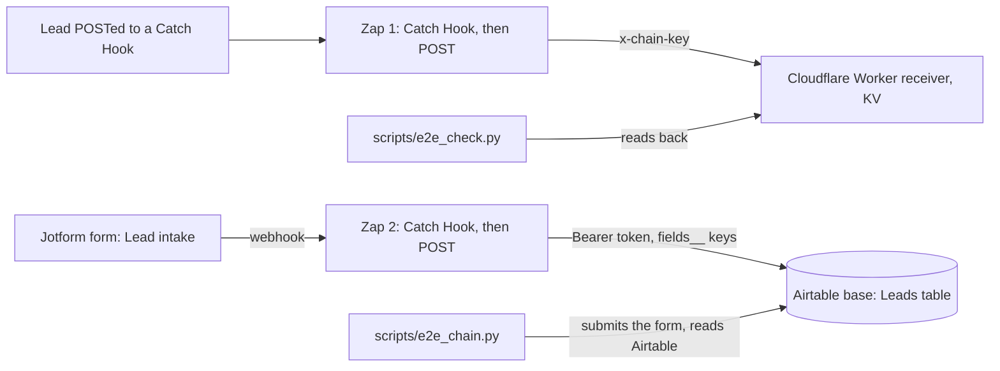

# Zapier lead-intake lab


Two small automations that run end to end and can be checked from outside, built with made-up leads (no customer, no real form, no real data):

1. **Hook to receiver.** A lead POSTed to a **Zapier Catch Hook** is mapped by a Zap and POSTed to a **Cloudflare Worker**, which stores it in KV and serves it back.
2. **Form to Airtable.** A **Jotform** form's webhook feeds a second Zap, which writes the lead into an **Airtable** table through Airtable's REST API.



## What is in it

| Part | What it does |
|---|---|
| `worker/receiver.js` | Stores a lead at `POST /ingest`, returns them at `GET /records`, clears at `DELETE /records`. Every route needs the shared key in `x-chain-key`; a wrong or missing key gets 401 |
| `scripts/deploy_receiver.py` | Deploys the Worker to a Cloudflare account with a KV namespace and the key as a Worker secret; reuses the saved key on a redeploy so the Zap keeps working |
| `scripts/airtable_setup.py` | Creates the "Lead intake lab" base and its Leads table (Name, Email, Message, Source) through Airtable's Metadata API; reuses it if it exists |
| `scripts/jotform_setup.py` | Creates the "Lead intake" form (Name, Email, Message) and attaches the Zap's Catch Hook as its webhook; `--submit` posts a test lead through the API |
| `scripts/e2e_check.py` | Sends a unique lead to Zap 1's hook, polls the Worker for exactly that lead and checks six things |
| `scripts/e2e_chain.py` | Submits a unique lead through the public Jotform form, polls Airtable for exactly that lead and checks five things (arrived within 120 s, name, email and message mapped, the Zap's fixed `source`) |
| `ZAP.md` | The written spec of both Zaps, since a Zap is built in the editor and cannot be committed as code |

## Proof

Measured 2026-10-04. Both Zaps were built in Zapier's editor, tested with the editor's own test step (real requests, stored by the receiver and by Airtable), published, and then fired from outside. `scripts/e2e_check.py` passes 6 of 6 and `scripts/e2e_chain.py` passes 5 of 5, and Zap history lists the runs as Successful (the first frame of the clip above).

## Run it

You need your own Zapier account (the Webhooks app needs a paid plan or the trial), a Cloudflare account, a Jotform account, an Airtable account and Python 3.

```
python scripts/deploy_receiver.py                        # prints the Worker URL
python scripts/airtable_setup.py <workspace id>          # prints the base and table ids
python scripts/jotform_setup.py <Zap 2 catch hook url>   # prints the form id and URL
# build both Zaps as written in ZAP.md, then:
ZAP_HOOK_URL=... RECEIVER_URL=... CHAIN_KEY=... python scripts/e2e_check.py
JOTFORM_FORM_ID=... AIRTABLE_BASE_ID=... AIRTABLE_TOKEN=... python scripts/e2e_chain.py
```

## Limits, stated plainly

- Both Zaps are two steps. They have run on made-up leads only, never a real form or real customers.
- The Webhooks app is a Zapier premium app, so the Zaps keep running after the 14-day trial only on a paid plan. The Airtable account is also on a trial.
- The receiver is a throwaway, not a CRM. Records expire after seven days.
- The Zaps are not in this repository because Zapier does not export one as code; `ZAP.md` is the spec. The Zaps post to Airtable's REST API with a webhook action rather than through Zapier's Airtable app.
- The Jotform and Airtable accounts were each created by hand because both sign-ups put a human check in front of automation; the scripts here start after that.
