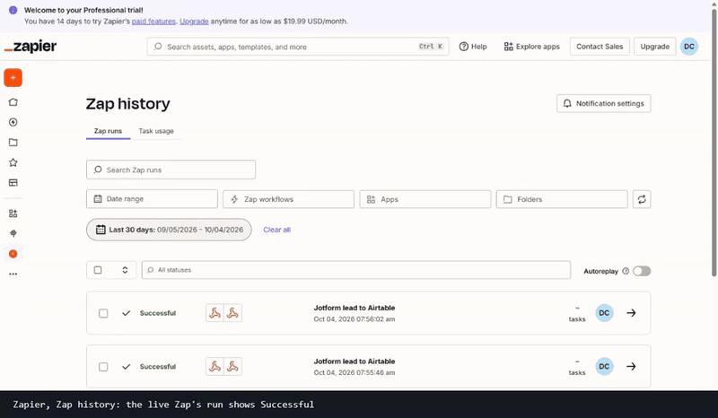
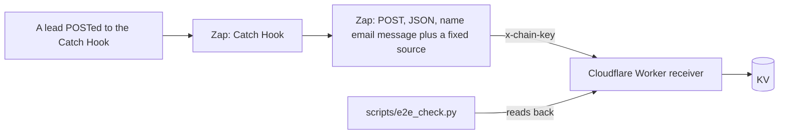

# Zapier lead-intake lab



A small automation that runs end to end and can be checked from outside: a lead is POSTed to a **Zapier Catch Hook**, the Zap maps three fields and POSTs them to a **Cloudflare Worker**, and the Worker stores the lead in KV and serves it back so a script can prove it arrived. It is a lab with made-up leads. There is no customer, no real form and no real data behind it.



## What is in it

| Part | What it does |
|---|---|
| `worker/receiver.js` | Stores a lead at `POST /ingest`, returns them at `GET /records`, clears at `DELETE /records`. Every route needs the shared key in `x-chain-key`; a wrong or missing key gets 401 |
| `scripts/deploy_receiver.py` | Deploys the Worker to a Cloudflare account with a KV namespace and the key as a Worker secret, and reuses the saved key on a redeploy so the Zap keeps working |
| `scripts/e2e_check.py` | Sends a unique lead to the Zap's hook, polls the receiver for exactly that lead, and checks six things: it arrived within 90 seconds, name, email and message were mapped, the Zap's fixed `source` replaced the caller's, and the request came from Zapier |
| `ZAP.md` | The written spec of the live Zap, since a Zap is built in the editor and cannot be committed as code |

## Proof

Measured 2026-10-04: the Zap was built in Zapier's editor, tested with the editor's own test step (a real POST that the receiver stored), published, and then fired from outside. `scripts/e2e_check.py` passes all six checks, and Zap history lists the run as Successful (the screenshot above).

## Run it

You need your own Zapier account (the Webhooks app needs a paid plan or the trial), a Cloudflare account and Python 3.

```
python scripts/deploy_receiver.py                       # prints the Worker URL
# build the Zap as written in ZAP.md, then:
ZAP_HOOK_URL=... RECEIVER_URL=... CHAIN_KEY=... python scripts/e2e_check.py
```

## Limits, stated plainly

- It is a two-step Zap. It is not a Jotform, Airtable or Google Sheets integration, and it has not run against a real form or real leads.
- The Webhooks app is a Zapier premium app, so the Zap keeps running after the 14-day trial only on a paid plan.
- The receiver is a throwaway, not a CRM. Records expire after seven days.
- The Zap itself is not in this repository because Zapier does not export one as code; `ZAP.md` is the spec.
